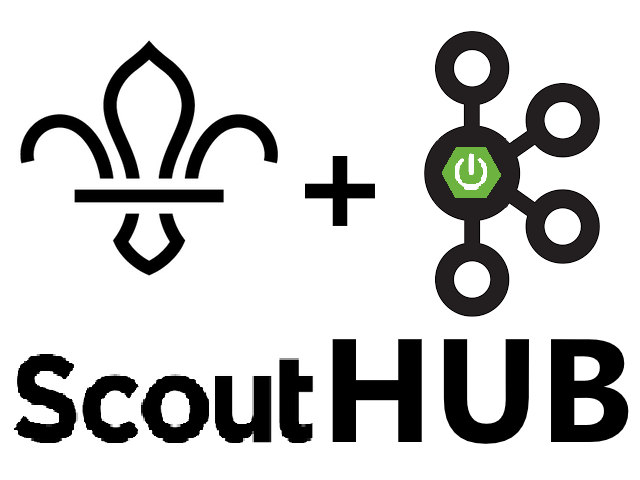
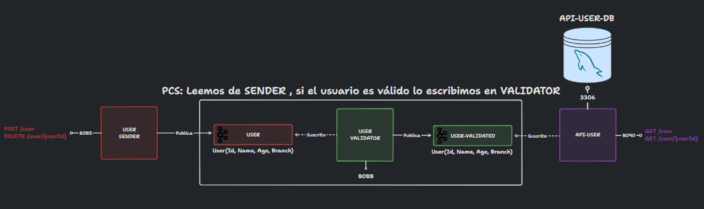
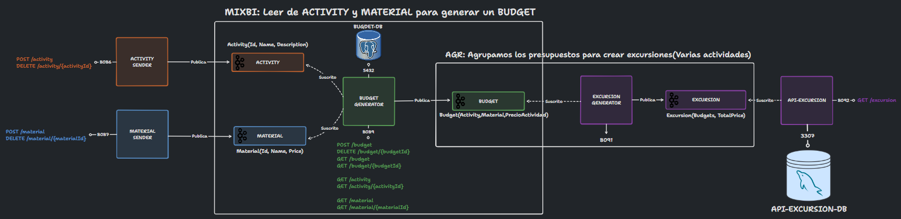

# Scout Hub

Scout Hub es un sistema de gestión de grupos scouts. Esta gestión es realizada
de forma asíncrona, con topics en concreto de Apache Kafka y con Spring Boot.

Los Scouts se dividen en ramas segun sus edades, para que un usuario sea
válido deberá cumplir el requisito de tener una edad y rama que concuerden
según la siguiente tabla:

| Rama    | Rango de Edades |
|---------|-----------------|
| BEAVER  | 6 - 8           |
| CUB     | 9 - 11          |
| RANGER  | 12 - 14         |
| PIONEER | 15 - 19         |
| SCOUTER | 20 - 100        |

Gracias a este sistema, podremos gestionar los usuarios de forma que no
hagamos registros inválidos. Además de poder generar excursiones y sus
presupuestos a partir de actividades y materiales. Todo esto facilita la labor
de gestion de un grupo Scout.

## Requisitos funcionales

### Usuarios

- Registrar un usuario.
- Eliminar un usuario.
- Consultar un usuario.
- Consultar todos los usuarios.
- Validar un usuario.

### Actividades

- Registrar una actividad.
- Eliminar una actividad.
- Consultar una actividad.
- Consultar todas las actividades.

### Materiales

- Registrar un material.
- Eliminar un material.
- Consultar un material.
- Consultar todos los materiales.

### Presupuestos

- Generar un presupuesto a partir de actividades y materiales.
- Eliminar un presupuesto.
- Consultar un presupuesto.
- Consultar todos los presupuestos.

### Excursiones

- Generar una excursión a partir de un presupuesto.
- Eliminar una excursión.
- Consultar una excursión.
- Consultar todas las excursiones.

## Requisitos no funcionales

- Se debe utilizar Apache Kafka.
- Requisitos mínimos:
    - Una API REST de inserción de datos.
    - Una API REST de consulta de datos.
    - Microservicio PCS que haga un map utilizando la low-level API.
    - Microservicio MIXBI que haga un join utilizando:
        - Low-level API, JPA y join de tablas.
        - High-level API, KTables y join de las mismas.
    - Microservicio AGR que haga una agregación utilizando la high-level API.

## Diagrama de funcionamiento

(Imagenes disponibles en /img)

# Revisar Fotos

### Parte de usuarios

### Parte de excursiones

(Ver imagen en el repositorio)

## Explicación del funcionamiento de los microservicios y topics

### Productores

- **USER SENDER**: Se gestiona la creación y eliminación de usuarios y se
  envían los mensajes al topic "user".

- **ACTIVITY SENDER**: Se gestiona la creación y eliminación de actividades
  y se envían los mensajes al topic "activity".

- **MATERIAL SENDER**: Se gestiona la creación y eliminación de materiales
  y se envían los mensajes al topic "material".

### Servicios

- **USER VALIDATOR**: Siguiendo la topología PCS, recibe los mensajes del
  topic "user", valida que los usuarios sean orrectos y los envía al topic "user-validated".

- **BUDGET GENERATOR**: Utiliza el patron MIXBI, recibe los mensajes de los topics "activity" y "material", genera un
  presupuesto y lo envía al topic "budget".

- **EXCURSION GENERATOR**: Utiliza la topología AGR, recibe los mensajes del topic "budget", genera una excursión y la
  envía al topic "excursion".

### API de consulta

- **API USER**: Recibe los mensajes del topic "user-validated", con los usuarios
  que son válidos y los almacena en la base de datos MySQL.

- **API EXCURSION**: Recibe los mensajes del topic "excursion", con las
  excursiones compuestas por varias actividades y las almacena en la base de datos.

## Detalles técnicos de la implementación

- Implementado totalmente con Docker y despliegue con Docker-Compose.

## Modelado de las entidades

ENSEÑAR TABLAS DE LA BASE DE DATOS Y EL SENTIDO QUE TIENEN

## Diagrama de clases

GENERAR DIAGRAMA DE CLASES EN CASO DE QUE SEA POSIBLE

## Guía de uso

1. ``mvn clean install`` para instalar las dependencias del proyecto.
2. ``docker-compose up --build`` para levantar todo el sistema.
3. Arrancar desde el IDE el servicio Config Server.
4. Arrancar desde el IDE el servicio Eureka Server.
5. Arrancar desde el IDE el servicio Gateway Server.
6. Arrancar desde el IDE los servicios User-Crud, Pizza-Read y Pizza-Write.

## Problemas conocidos

# HACER EL SWAGGER

## Servicios implementados

### Swagger

- User-Sender: http://localhost:8085/swagger-ui.html
- Activity-Sender: http://localhost:8086/swagger-ui.html
- Material-Sender: http://localhost:8087/swagger-ui.html
- Budget-Generator: http://localhost:8089/swagger-ui.html (No va)
- Excursion-Generator: http://localhost:8091/swagger-ui.html (No va)
- Api-User: http://localhost:8090/swagger-ui.html
- Api-Excursion: http://localhost:8092/swagger-ui.html (No va)

### Kafka

- Kowl: http://localhost:18080/
- Schema-Registry: http://localhost:8084/
- Zookeeper: http://localhost:2181/
- Kafka: http://localhost:9092/

### Bases de datos

- Budget-Generator: http://localhost:8089/h2-console
- Api-User: http://localhost:8090/h2-console
- Api-Excursion: http://localhost:8092/h2-console

## Valor añadido

# añadir si hago jenkins o algo de eso

## Autor

Alberto Cano Delgado

