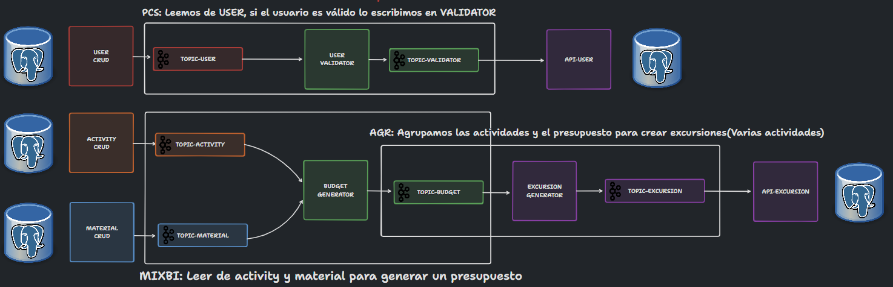

# Scout Hub

Scout Hub es un sistema de gestión de grupos scouts. Esta gestión es realizada
de forma asíncrona, con colas de mensajería, Apache Kafka y Spring Cloud.

Gracias a este sistema, podremos gestionar los usuarios de forma que no
hagamos registros inválidos. Además de poder generar presupuestos de
excursiones a partir de actividades y materiales. Todo esto facilita la labor de
que cuadren los recursos y presupuestos.

## Diagrama de funcionamiento

## Explicación del funcionamiento de los microservicios y topics

- **USER CRUD**: Se gestiona la creación, modificación, eliminación y obtención de usuarios y se envían los mensajes al
  topic "user".

- **USER VALIDATOR**: Siguiendo la topología PCS, recibe los mensajes del topic "user", valida que los usuarios estén
  correctos y los envía al topic "validator".

- **API USER**: Recibe los mensajes del topic "validator", con los usuarios que son válidos y los almacena en la base de
  datos.

- **ACTIVITY CRUD**: Se gestiona la creación, modificación, eliminación y obtención de actividades y se envían los
  mensajes
  al topic "activity".

- **MATERIAL CRUD**: Se gestiona la creación, modificación, eliminación y obtención de materiales y se envían los
  mensajes
  al topic "material".

- **BUDGET GENERATOR**: Utiliza el patron MIXBI, recibe los mensajes de los topics "activity" y "material", genera un
  presupuesto y lo envía al topic "budget".

- **EXCURSION GENERATOR**: Utiliza la topología AGR, recibe los mensajes del topic "budget", genera una excursión y la
  envía
  al topic "excursion".

- **API EXCURSION**: Recibe los mensajes del topic "excursion", con las excursiones que son válidas y las almacena en la
  base de datos.

## Requisitos funcionales

### User-Crud

- Registrar un usuario.
- Modificar un usuario.
- Eliminar un usuario.
- Obtener un usuario por id.
- Obtener todos los usuarios.

### Activity-Crud

- Registrar una mascota.
- Modificar una mascota.
- Eliminar una mascota.
- Obtener una mascota por id.
- Obtener todas las mascotas.

### Material-Crud

- Registrar una mascota.
- Modificar una mascota.
- Eliminar una mascota.
- Obtener una mascota por id.
- Obtener todas las mascotas.

## Requisitos no funcionales

- Se debe utilizar Apache Kafka.
- Mínimo una API REST.
- Una API REST de consulta de datos.
- Microservicio PCS que haga un map utilizando la low level API de Kafka.
- Microservicio AGR que haga un join (con JPA) utilizando la low level API de Kafka.
- Microservicio AGR que haga un reduce utilizando la low level API de Kafka.

## Modelado de las entidades

ENSEÑAR TABLAS DE LA BASE DE DATOS Y EL SENTIDO QUE TIENEN

## Diagrama de clases

## Guía de uso

1. ``mvn clean install`` para instalar las dependencias del proyecto.
2. ``docker-compose up --build`` para levantar Rabbitmq, Zipkin y Postgres, .
3. Arrancar desde el IDE el servicio Config Server.
4. Arrancar desde el IDE el servicio Eureka Server.
5. Arrancar desde el IDE el servicio Gateway Server.
6. Arrancar desde el IDE los servicios User-Crud, Pizza-Read y Pizza-Write.

## Problemas conocidos

- o.s.c.l.core.RoundRobinLoadBalancer: No servers available for service:
  Ocurre al reiniciar un microservicio, no es detectado por el Gateway Server. Posible
  solucion [SimpleDiscoveryClient](https://docs.spring.io/spring-cloud-commons/docs/current/reference/html/#simplediscoveryclient).

## Documentación

- Config server: http://localhost:8888/<nombre_servicio>/default
- Eureka server: http://localhost:8761/
- Gateway: http://localhost:9001/
# HACER EL SWAGGER
- User-Crud: http://localhost:8080/swagger-ui.html
- Pet-Crud: http://localhost:8081/swagger-ui.html
- Health: http://localhost:8082/swagger-ui.html
- Adoption: http://localhost:8083/swagger-ui.html
- Zipkin: http://localhost:9411/zipkin/
- Prometheus: http://localhost:9090/
- Grafana: http://localhost:3000/
- Kibana: http://localhost:5601/
- Sonar: http://localhost:9000/
- Jenkins: http://localhost:8084/

## Valor añadido

- Swagger con los endpoints de los microservicios documentados.

## Autor

Alberto Cano Delgado

