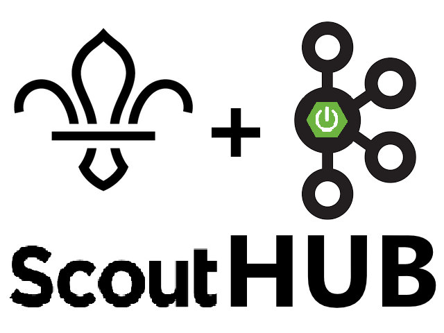
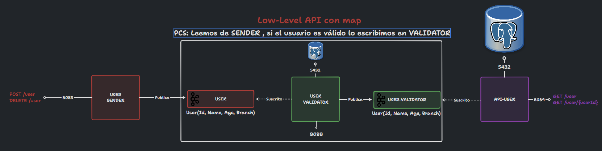
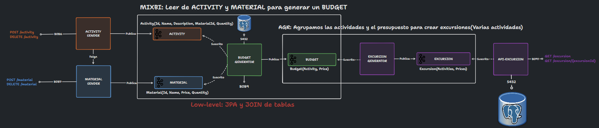

# Scout Hub

Scout Hub es un sistema de gestión de grupos scouts. Esta gestión es realizada
de forma asíncrona, con colas de mensajería en concreto con Apache Kafka 
y con Spring Boot

Los Scouts se dividen en ramas segun sus edades, para que un usuario sea 
válido deberá cumplir el requisito de tener una edad y rama que concuerden 
según la siguiente tabla:

| Rama    | Rango de Edades |
|---------|-----------------|
| BEAVER  | 6 - 8           |
| CUB     | 9 - 11          |
| RANGER  | 12 - 14         |
| PIONEER | 15 - 19         |
| SCOUTER | 20 - 100        |

Gracias a este sistema, podremos gestionar los usuarios de forma que no
hagamos registros inválidos. Además de poder generar presupuestos de
excursiones a partir de actividades y materiales. Todo esto facilita la labor de
que cuadren los recursos y presupuestos.

## Diagrama de funcionamiento

# Revisar Fotos

### Parte de usuarios

### Parte de excursiones

(Ver imagen en el repositorio)

## Explicación del funcionamiento de los microservicios y topics

### Productores

- **USER SENDER**: Se gestiona la creación, modificación, eliminación y obtención de usuarios y se envían los mensajes
  al
  topic "user".

- **ACTIVITY SENDER**: Se gestiona la creación, modificación, eliminación y obtención de actividades y se envían los
  mensajes al topic "activity".

- **MATERIAL SENDER**: Se gestiona la creación, modificación, eliminación y obtención de materiales y se envían los
  mensajes al topic "material".

### Servicios

- **USER VALIDATOR**: Siguiendo la topología PCS, recibe los mensajes del topic "user", valida que los usuarios estén
  correctos y los envía al topic "validator".

- **BUDGET GENERATOR**: Utiliza el patron MIXBI, recibe los mensajes de los topics "activity" y "material", genera un
  presupuesto y lo envía al topic "budget".

- **EXCURSION GENERATOR**: Utiliza la topología AGR, recibe los mensajes del topic "budget", genera una excursión y la
  envía al topic "excursion".

### API de consulta

- **API USER**: Recibe los mensajes del topic "validator", con los usuarios que son válidos y los almacena en la base de
  datos.

- **API EXCURSION**: Recibe los mensajes del topic "excursion", con las excursiones que son válidas y las almacena en la
  base de datos.

## Requisitos funcionales

### User-Crud

- Registrar un usuario.
- Eliminar un usuario.

### Activity-Crud

- Registrar una actividad.
- Eliminar una actividad.

### Material-Crud

- Registrar un material.
- Eliminar un material.

## Requisitos no funcionales

- Se debe utilizar Apache Kafka.
- Mínimo una API REST.
- Una API REST de consulta de datos.
- Microservicio PCS que haga un map utilizando la low level API de Kafka.
- Microservicio AGR que haga un join (con JPA) utilizando la low level API de Kafka.
- Microservicio AGR que haga un reduce utilizando la low level API de Kafka.

## Modelado de las entidades

ENSEÑAR TABLAS DE LA BASE DE DATOS Y EL SENTIDO QUE TIENEN

## Diagrama de clases

GENERAR DIAGRAMA DE CLASES EN CASO DE QUE SEA POSIBLE

## Guía de uso

1. ``mvn clean install`` para instalar las dependencias del proyecto.
2. ``docker-compose up --build`` para levantar Rabbitmq, Zipkin y Postgres, .
3. Arrancar desde el IDE el servicio Config Server.
4. Arrancar desde el IDE el servicio Eureka Server.
5. Arrancar desde el IDE el servicio Gateway Server.
6. Arrancar desde el IDE los servicios User-Crud, Pizza-Read y Pizza-Write.

## Problemas conocidos

## Información tecnica

Se pueden crear los topics con las particiones que queramos, para ello en la config de los micoros hay que desactivar
autocreate topics y en el docker compose hay que descomentar la linea #KAFKA_CREATE_TOPICS: "user:3:1, material:3:1"

## Documentación

# HACER EL SWAGGER

- User-Sender: http://localhost:8085/swagger-ui.html
- Activity-Sender: http://localhost:8086/swagger-ui.html
- Material-Sender: http://localhost:8087/swagger-ui.html

- Kowl: http://localhost:18080/topics

## Valor añadido

- Swagger con los endpoints de los microservicios documentados.
- Microservicios Dockerizados y despliegue directo desde el docker-compose.

## Autor

Alberto Cano Delgado

